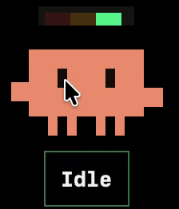
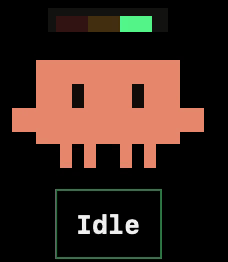

# ClaudeLight

一个悬浮像素桌宠 + 菜单栏图标，实时显示 [Claude Code](https://claude.ai/code) 的当前状态。

🟢 空闲  |  🟡 工作中  |  🔴 等你回应

| 状态灯变化 | &nbsp;&nbsp;&nbsp;&nbsp;&nbsp;&nbsp;&nbsp;&nbsp;&nbsp;&nbsp;&nbsp;&nbsp; | 鼠标摸头 |
|:---:|:---:|:---:|
|  | &nbsp;&nbsp;&nbsp;&nbsp;&nbsp;&nbsp;&nbsp;&nbsp;&nbsp;&nbsp;&nbsp;&nbsp; |  |

## 快速开始

### 1. 下载

| 平台 | 下载 |
|------|------|
| **macOS** | [Releases](https://github.com/Youchengw/ClaudeLight/releases) 下载 `ClaudeLight-macOS.zip` → 拖到 `/Applications` |
| **Windows** | [Releases](https://github.com/Youchengw/ClaudeLight/releases) 下载 `ClaudeLight.exe` |
| **Linux** | [Releases](https://github.com/Youchengw/ClaudeLight/releases) 下载 `ClaudeLight` 二进制，或从源码运行：`pip install -r desktop/requirements.txt && python desktop/main.py` |

### 2. 安装插件

```bash
git clone https://github.com/Youchengw/ClaudeLight.git
cd ClaudeLight
./scripts/install.sh
```

### 3. 使用 Claude Code

打开 ClaudeLight，然后正常使用 `claude`。状态灯会自动跟随。

## 功能

- 像素风桌宠带红绿灯 — 始终置顶、可拖动、位置记忆
- 菜单栏图标 / 系统托盘图标自动适配浅色/深色模式
- 待机浮动动画 + 鼠标悬停摸头动画
- 支持开机自启动（macOS）

## 从源码构建

**macOS**（原生 SwiftUI，需要 Xcode 16+、macOS 14+）：

```bash
./scripts/build-release-app.sh            # 构建并安装到 /Applications
swift run ClaudeLight                     # 直接通过 Swift Package Manager 运行
./scripts/package-release-zip.sh          # 打包为 .zip → ./dist/
```

**Windows / Linux**（Python + PyQt6）：

```bash
cd desktop
pip install -r requirements.txt
python main.py                            # 直接运行
# Windows: build_windows.bat              # → dist/ClaudeLight.exe
# Linux:   ./build_linux.sh               # → dist/ClaudeLight
```

## 工作原理

```
Claude Code → Hook 插件 → status.json ← 文件监控 ← 桌面应用
```

| Hook | 状态 |
|------|------|
| `UserPromptSubmit` / `PreToolUse` / `PostToolUse` | 工作中 |
| `Notification.permission_prompt` / `elicitation_dialog` | 等你回应 |
| `Stop` / `SessionEnd` / `idle_prompt` | 空闲 |

## 卸载

```bash
./scripts/uninstall.sh                    # 卸载插件
sudo rm -rf /Applications/ClaudeLight.app # 删除应用（macOS）
```

## License

MIT © Youcheng Wang

---

[English](README.md)
